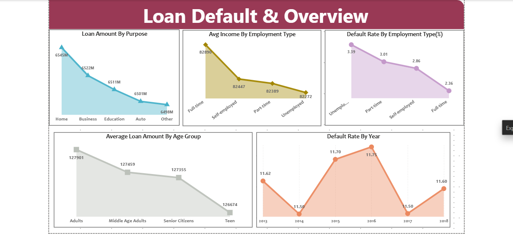
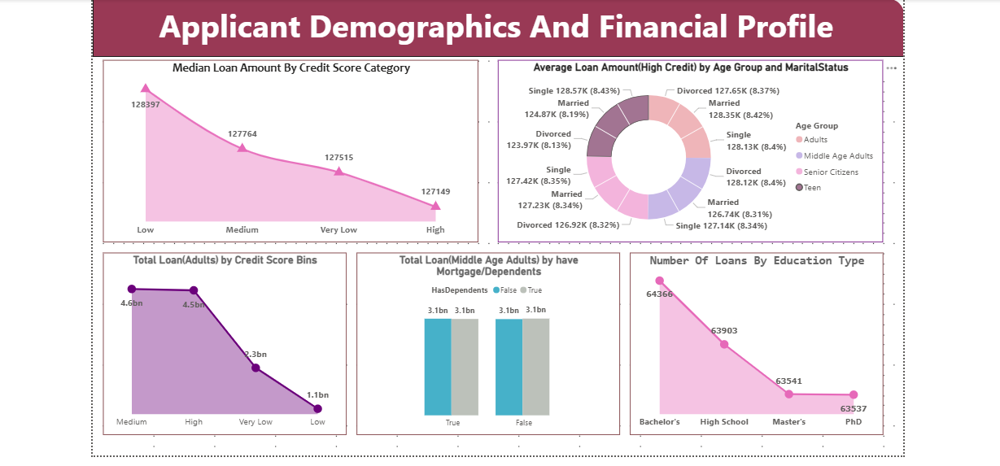
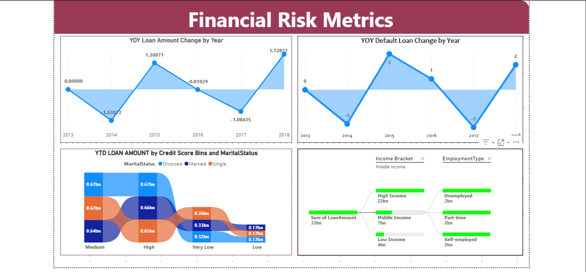

# Loan Default Risk & Financial Analytics Dashboard
**Tool:** Power BI | **Domain:** Banking & Financial Services | **Data Source:** SQL Server via Dataflow | **Period:** 2013–2018

---

## Problem Statement

Financial institutions face significant losses due to loan defaults. Identifying high-risk borrower segments early — based on employment type, credit score, age group, and income bracket — is critical for risk management and lending decisions.

This end-to-end Power BI solution connects directly to a **SQL Server database via Power BI Dataflow**, enabling automated data refresh and real-time portfolio monitoring. The dashboard gives risk analysts and business managers a complete view of default patterns, borrower demographics, and year-over-year financial risk trends.

---

## Dashboard Pages

### Page 1 — Loan Default & Overview
- **Loan Amount by Purpose:** Home loans lead at 6,545M, followed by Business (6,522M), Education (6,511M), Auto (6,501M), Other (6,498M)
- **Avg Income by Employment Type:** Full-time (82,890) → Self-employed (82,447) → Part-time (82,389) → Unemployed (82,272)
- **Default Rate by Employment Type:** Unemployed borrowers have the highest default rate (3.39%), Full-time the lowest (2.36%)
- **Average Loan Amount by Age Group:** Adults (127,901) > Middle Age Adults (127,459) > Senior Citizens (127,355) > Teen (126,674)
- **Default Rate by Year (2013–2018):** Peaked at 11.75% in 2016, lowest at 11.50% in 2014 and 2017

### Page 2 — Applicant Demographics & Financial Profile
- **Median Loan Amount by Credit Score:** Low credit (128,397) has highest median loan — counterintuitive insight worth investigating
- **Avg Loan (High Credit) by Age Group & Marital Status:** Donut chart breaking down 128K+ loan amounts across Singles, Married, Divorced across all age groups
- **Total Loan (Adults) by Credit Score Bins:** Medium (4.6bn) and High (4.5bn) dominate, Low credit at just 1.1bn
- **Total Loan (Middle Age Adults) by Mortgage/Dependents:** Equal split — 3.1bn with dependents vs 3.1bn without
- **Number of Loans by Education Type:** Bachelor's (64,366) > High School (63,903) > Master's (63,541) > PhD (63,537)

### Page 3 — Financial Risk Metrics
- **YOY Loan Amount Change:** Sharp decline in 2014 (-1.53), recovery in 2015 (+1.30), dip in 2017 (-1.08), strong growth in 2018 (+1.73)
- **YOY Default Loan Change:** Peaked in 2015 (+3), dropped to -3 in both 2014 and 2017
- **YTD Loan Amount by Credit Score & Marital Status:** Sankey/flow chart showing Medium and High credit borrowers dominate across all marital statuses
- **Decomposition Tree:** Income Bracket × Employment Type breakdown — Middle Income (33bn total), High Income (22bn), Low Income (4bn)

---

## Business Questions Answered
- Which borrower segments carry the highest default risk?
- How does employment type and income bracket affect default probability?
- What is the year-over-year trend in loan defaults and total loan volume?
- How do credit score categories distribute across different age and marital status groups?
- Which loan purposes drive the most volume?
- How does education level correlate with number of loans taken?

---

## Key Insights
- **Unemployed borrowers default at 3.39%** — 44% higher than full-time employees (2.36%) — indicating employment stability is the strongest default predictor
- **Default rate peaked at 11.75% in 2016** then dropped to 11.50% in 2017, suggesting possible tightening of lending criteria
- **Low credit score borrowers have the highest median loan amount (128,397)** — a risk flag indicating potential over-lending to high-risk applicants
- **Home loans dominate at 6,545M** — nearly equal across all purposes, suggesting a well-diversified loan portfolio
- **Bachelor's degree holders take the most loans (64,366)** — nearly identical across all education levels, indicating education has minimal impact on loan uptake

---

## Technical Implementation

### Data Pipeline
```
SQL Server Database
      ↓
Power BI Dataflow (Power BI Service)
      ↓
Power BI Desktop (imported from Dataflow)
      ↓
Scheduled Refresh + Incremental Refresh
      ↓
Published to Power BI Service
```

### Advanced DAX Measures
```
-- Loan Amount by Purpose (excludes blanks)
Loan By Purpose = SUMX(FILTER(Loans, NOT(ISBLANK(Loans[Purpose]))), Loans[LoanAmount])

-- Default Rate by Employment Type
Default Rate = DIVIDE(COUNTROWS(FILTER(Loans, Loans[Default]=1)), COUNTROWS(Loans))

-- Average Income by Employment Type
Avg Income = CALCULATE(AVERAGE(Loans[Income]), ALLEXCEPT(Loans, Loans[EmploymentType]))

-- Year Over Year Loan Change
YOY Loan Change = [Current Year Loans] - [Previous Year Loans]

-- Year To Date Loan Amount
YTD Loan = CALCULATE(SUM(Loans[LoanAmount]), DATESYTD(Calendar[Date]))

-- Median Loan by Credit Score
Median Loan = MEDIANX(VALUES(Loans[CreditScore]), [Total Loan Amount])

-- Decomposition Tree Measure
Income Bracket Switch = SWITCH(TRUE(), Loans[Income]>70000, "High Income",
                               Loans[Income]>40000, "Middle Income", "Low Income")
```

### DAX Functions Used
`SUMX` `FILTER` `NOT` `ISBLANK` `CALCULATE` `AVERAGE` `ALLEXCEPT` `ALL` `COUNTROWS` `DIVIDE` `AVERAGEX` `VALUES` `MEDIANX` `DATESYTD` `SWITCH` `YOY` `YTD`

### Infrastructure & Setup
- Installed and configured **Standard Mode Gateway** for SQL Server connectivity
- Created **Power BI Dataflow** in Power BI Service as the central data source
- Set up **Scheduled Refresh** for Dataflow and Report independently
- Configured **Incremental Refresh** for large dataset efficiency

---

## Screenshots

### Page 1 — Loan Default & Overview


### Page 2 — Applicant Demographics & Financial Profile


### Page 3 — Financial Risk Metrics


---

## How to Open
1. Download **Power BI Desktop** for free from [microsoft.com](https://powerbi.microsoft.com/desktop)
2. Clone or download this repository
3. Open the `.pbix` file in Power BI Desktop
> Note: Live Dataflow connection requires Power BI Service access. For offline viewing, the report can be used with cached data.

---

## Tools & Concepts Used
| Area | Details |
|------|---------|
| Data Source | Microsoft SQL Server → Power BI Dataflow |
| Tool | Power BI Desktop + Power BI Service |
| DAX | SUMX, FILTER, CALCULATE, ALLEXCEPT, MEDIANX, AVERAGEX, DATESYTD, SWITCH, YOY, YTD |
| Visuals | Area charts, donut chart, decomposition tree, Sankey chart, line charts |
| Infrastructure | Gateway setup, Dataflow creation, Scheduled + Incremental Refresh |
| Published | Power BI Service with automated refresh pipeline |
